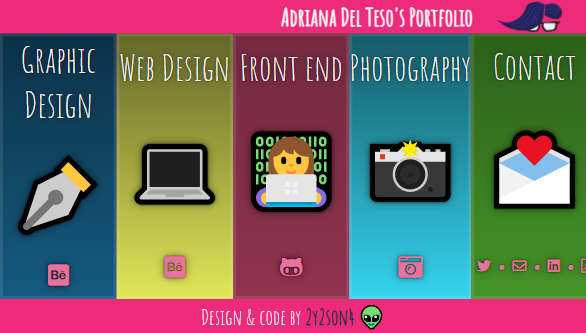

# Flex portfolio.

Portfolio made using (mostly) flexbox in CSS and a little bit of vanilla JS to give it movement and charm, isn't it adorable? 😊

Includes links to show my work a little bit and all the ways to contact me. Let's keep in touch!

Click here to check the <strong>animations</strong>.

Based on exercise 5 from the [#javascript30 challenge of Wes Bos](https://javascript30.com/).

[Link to demo.](https://2y2son4.github.io/flex-portfolio/)
